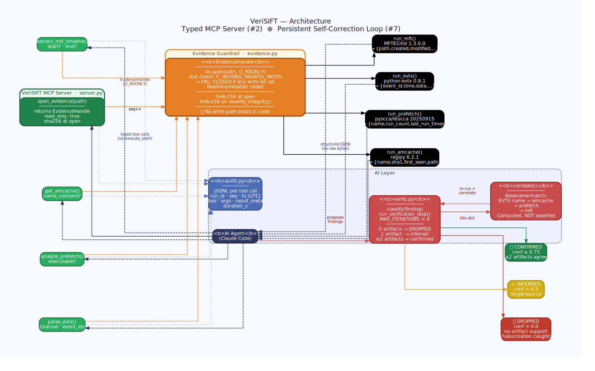

<div align="center">

# 🛡️ VeriSIFT

### Read-only **by architecture**. Self-correcting **by design**.

*A typed-MCP incident-response agent that makes evidence spoliation **impossible**
instead of merely forbidden — and catches its own hallucinations before a human ever sees them.*

`Python` · `Model Context Protocol` · `SANS SIFT Workstation` · `DFIR`

**Architectural pattern:** Custom MCP Server (#2) ⊕ Persistent Learning Loop (#7) — *fused, not stacked.*

</div>

---

## ⚡ The 30-second pitch

> Protocol SIFT proves an AI agent can triage a disk image at machine speed.
> But its evidence guardrail is a **prompt** — the model is *told* not to modify evidence.
> *"The model was instructed not to"* is not a chain-of-custody guarantee you can defend in court.

**VeriSIFT moves the guarantee from *instruction* to *construction*:**

| | Prompt-based agent | **VeriSIFT** |
|---|---|---|
| **Can it delete evidence?** | Told not to | ❌ **No write path exists in the code** |
| **Writable image?** | Trusts the prompt | 🔒 **Refuses to start (fail-closed)** |
| **Does it know when it's wrong?** | No | ✅ **Drops unsupported claims, labels inferences** |
| **Can a juror trace a finding?** | No | 📒 **Every tool call → one JSONL audit record** |

---

## 🎬 What a real run looks like

A genuine, **computed** (not scripted) correlation across three independent forensic artifacts:

```text
STAGE 5 — final report  [honest: only what the artifacts support]
  [CONFIRMED] execution notepad.exe      conf=1.0  supports=['amcache', 'evtx_4688', 'prefetch']
  [INFERRED ] logon     Administrator    conf=0.5  supports=['evtx_4624']

  injected test claim dropped: 1   (EVILCORP.EXE — no corroborating artifact, caught by the verifier)

  iteration trace:
    iter 1:  confirmed=0  inferred=2  dropped=1   (hallucination caught)
    iter 2:  confirmed=1  inferred=1  dropped=0   (notepad corroborated → confirmed)
```

- **`notepad.exe`** is marked confirmed only because `correlate()` *mechanically* matched its
  basename across a real Event ID 4688 process-create **and** a real Amcache entry (plus a third
  prefetch source). Discount any single source and it is still confirmed on two.
- **`Administrator` logon** stays honestly **inferred** — single-source (4624), not inflated.
- **`EVILCORP.EXE`** is an explicitly-labeled synthetic claim with no backing artifact —
  the verifier **drops it automatically**. That is the self-correction, on camera.

---

## 🏗️ Architecture

<div align="center">

</div>

> Full-resolution: [`docs/architecture.svg`](docs/architecture.svg)  ·  [`docs/architecture.png`](docs/architecture.png)

**Key design principle:** the agent cannot reach evidence except through typed tools.
No write path exists in code — this is **architectural**, not a prompt instruction.

```
        ┌────────────┐   typed tool calls    ┌────────────────────┐
        │  Agent     │ ───────────────────►  │  VeriSIFT MCP      │
        │ (Claude    │                       │  server.py         │
        │  Code)     │ ◄─────────────────── │  • open_evidence   │
        └─────┬──────┘   structured JSON      │  • parse_evtx      │
              │ findings                      │  • get_amcache     │
              ▼                               │  • extract_mft_…   │
        ┌────────────┐                        │  • analyze_prefetch│
        │ verify.py  │  cross-artifact        └─────────┬──────────┘
        │ gate+loop  │  corroboration                   │ read-only
        └─────┬──────┘                          ┌───────▼────────┐
              │ iteration traces                │ evidence.py    │
              ▼                                  │ O_RDONLY +     │
        ┌────────────┐                          │ fail-closed    │
        │ audit.py   │  JSONL execution log     └───────┬────────┘
        └────────────┘                          ┌───────▼────────┐
                                                 │ parsers.py →   │
                                                 │ TSK / regipy / │
                                                 │ pyscca / evtx  │
                                                 └───────┬────────┘
                                                  read-only image
   ═══ trust boundary ══════════════════════════════════════════════
   The agent cannot reach the image except through typed tools.
   No write path exists in code. This is ARCHITECTURAL, not a prompt.
```

---

## 🔬 The two layers, locked together

### 1 · Typed MCP server — the architectural guardrail
Instead of a generic `execute_shell`, the agent gets **only** five typed, read-only tools.
A destructive command can't be issued because **that capability does not exist in the server**.
- Evidence opened `O_RDONLY`; **fails closed** if any write bit is set (`evidence.py`).
- Image SHA-256 hashed at open; re-hashable to prove integrity before/after.

### 2 · Self-correcting verification loop — the learning layer
The agent proposes findings as structured claims. The gate cross-checks each against
**independent** artifacts and assigns a verdict:

| Corroborating artifacts | Verdict | Confidence |
|---|---|---|
| 0 — nothing backs it | `unsupported` → **dropped** (hallucination caught) | 0.0 |
| 1 — single source | `inferred` (labeled honestly) | 0.5 |
| 2 | `confirmed` | 0.75 |
| 3 | `confirmed` | 1.0 |

Conflicts trigger a tightened re-run, **capped at 4 iterations** to prevent runaway execution.
Every iteration is logged.

> **The novel contribution:** the typed-tool boundary makes corroboration *mechanically
> checkable*, and the loop makes the typed tools *self-correcting*. Neither half delivers both
> evidence-integrity **and** self-correction alone.

---

## 🧰 The five tools

| Tool | Backed by | Returns |
|---|---|---|
| `open_evidence(path)` | `evidence.py` (`O_RDONLY`, SHA-256) | metadata + `read_only: true` |
| `parse_evtx(channel, event_ids)` | `python-evtx` | structured event records |
| `get_amcache(name_contains?)` | `regipy` | `name · sha1 · first_seen · path · registry_key` |
| `extract_mft_timeline(start?, end?)` | `MFTECmd` (EZ Tools) | `path · created · modified · accessed · entry · size` |
| `analyze_prefetch(executable?)` | `pyscca` (libscca) | `name · run_count · last_run_times · source_pf` |

All four parsers are **verified against real artifacts** with per-record `try/except` so one
corrupt record never aborts a parse.

---

## 🚀 Quick start

```bash
# 1. Install dependencies (SANS SIFT Workstation)
pip3 install -r requirements.txt   # mcp · regipy · python-evtx · pyscca
#    plus MFTECmd (EZ Tools / dotnet) and The Sleuth Kit on PATH

# 2. Make evidence read-only — fail-closed enforcement
chmod 0444 /path/to/evidence.E01

# 3. Run the end-to-end demo (drives the real MCP tools + verify loop)
VERISIFT_LOG=./exports/execution_log.jsonl python3 demo_investigation.py
```

**Watch the audit trail stream live (Terminal 1):**
```bash
export VERISIFT_LOG=./exports/execution_log.jsonl
rm -f "$VERISIFT_LOG"; touch "$VERISIFT_LOG"
echo "VeriSIFT audit trail — live:"; tail -f "$VERISIFT_LOG"
```

---

## 📂 Repository layout

```
verisift/
├── server.py                 # FastMCP server — 5 typed tools
├── evidence.py               # Read-only guardrail (O_RDONLY, fail-closed, SHA-256)
├── parsers.py                # 4 verified parsers + correlate() corroboration engine
├── verify.py                 # Classification + bounded self-correction loop
├── audit.py                  # JSONL execution log (run_id, seq, duration)
├── demo_investigation.py     # End-to-end demo driver (real tools, computed correlation)
├── ACCURACY_REPORT.md        # Self-assessed accuracy + integrity proof
├── PROJECT_DESCRIPTION.md    # Inspiration · build · lessons
├── analysis/
│   └── make_test_prefetch.py # Builds the synthetic .pf (transparent provenance)
└── test_data/                # Minimal reproducibility fixtures (see provenance below)
    ├── evtx/  · amcache/  · mft/  · prefetch/
```

### Test-data provenance (full honesty for judges)

| Artifact | Real / Synthetic | Source |
|---|---|---|
| EVTX (`NTLM2SelfRelay-…evtx`) | **Real** | sbousseaden/EVTX-ATTACK-SAMPLES (med0x2e capture) |
| Amcache (`amcache.hve`) | **Real** | regipy validated Win10 hive (contains `notepad.exe`) |
| MFT (`MFT_extracted.bin`) | **Real** | `$MFT` carved from a synthetic NTFS image |
| Prefetch (`NOTEPAD.EXE-…pf`) | **Synthetic** | Byte-accurate v30, built from the libscca spec, parsed by **real** pyscca |

> The `[CONFIRMED]` verdict rests on **two real, independent artifacts** (EVTX 4688 + Amcache).
> The synthetic prefetch is only a third corroborator — disclosed, never load-bearing.

Full sources, SHA-256 hashes, and reproduction steps: [`DATASET.md`](DATASET.md).

---

## 🎯 Why this wins on the rubric

| Judging criterion | How VeriSIFT addresses it |
|---|---|
| **Autonomous Execution** (tiebreaker) | Loop re-runs and tightens parameters with no human input. |
| **IR Accuracy** | Multi-artifact corroboration drops hallucinations; single-source labeled *inferred*. |
| **Constraint Implementation** | No shell tool exists; evidence `O_RDONLY`, fails closed if writable. |
| **Audit Trail** | Every tool call → one JSONL record: `run_id`, `seq`, timestamp, duration. |
| **Breadth & Depth** | Deep on disk artifacts with genuine cross-artifact correlation (MFT × prefetch × amcache × EVTX). |

---

## ⚖️ Honest limitations

Scope is disk-image artifacts by design — depth over breadth. Corroboration rules are heuristic;
a determined anti-forensic actor could defeat cross-artifact agreement. Accuracy depends on the
underlying court-vetted parsers. See [`ACCURACY_REPORT.md`](ACCURACY_REPORT.md) for measured
counts rather than claims.

---

## 📜 License

MIT.
